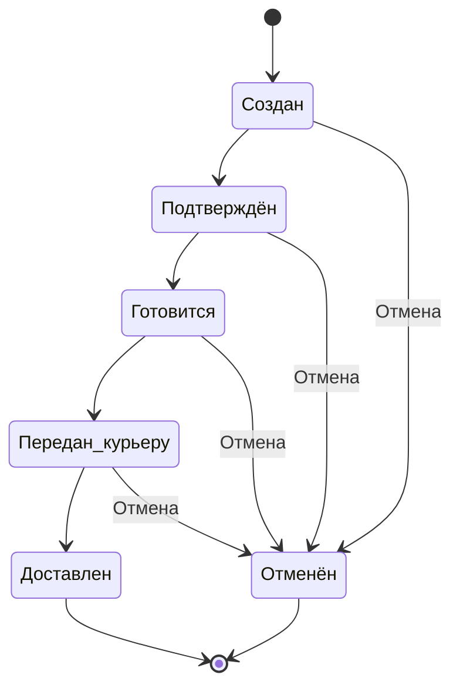

# **Регистрация пользователя с проверкой контактных данных**

>## **Тестируемые объекты:**
>- Поле для ввода номера телефона
>- Поле для ввода e-mail
>- Поле для ввода адреса доставки
>- Логика валидации данных (в т.ч. проверка уникальности e-mail)

>## **Чек-лист проверок:**
>- Проверка корректной работы поля ввода номера телефона - система должна пропускать только формат +43XXXXXXXXXX
>- Проверка длины имени пользователя в поле - система должна пропускать диапазон символов от 2 до 50
>- Проверка длины адреса доставки в поле - система должна пропускать диапазон символов от 10 до 100
>- Проверка уникальности e-mail - система должна отклонять повторные регистрации, если e-mail уже существует в базе данных
>- Проверка отображения сообщений об ошибке для пользователя

>## Тестовая стратегия Фронтенд (UI):
>- Проверка валидности формата номера телефона +43XXXXXXXXXX с выводом ошибки при некорректности
>- Проверка ограничения при введении имени с обязательным выводом сообщения об ошибки пользователю
>- Проверка ограничения при введении адреса доставки с обязательным выводом сообщения об ошибки пользователю

>## Тестовая стратегия Бэкенд (API):
>- Проверка корректного отображения всех данных пользователя (номер телефона, имя, адрес доставки), указанным им во время регистрации
>- Проверка уникальности e-mail на сервере - система должна отклонять регистрацию с уже существующим в базе e-mail
>- Проверка поведения системы при использовании пользователем некорректых данных - результатом должен быть отказ системы в обработке

>## Тестовые сценарии:
>>### Эквивалентное разбиение (классы эквивалентности)
>>
>>|Условие|Валидные классы|Невалидные классы|
>>|:---|:---|:---|
>>|Номер телефона|Соответствующий формату +43XXXXXXXXXX, где X - цифра|Не соответствующий формату +43XXXXXXXXXX и/или имеющий некорректную длину, содержащий буквы или символы|
>>|Имя пользователя|От 2 до 50 символов включительно|Меньше 2 символов или больше 50 символов не включительно|
>>|Адрес доставки|От 10 до 100 символов включительно|Меньше 10 символов или больше 100 символов не включительно|
>>|E-mail при регистрации|Еще не зарегистрирован в системе|Уже зарегистрирован в системе|
>
>>### Анализ граничных значений (для длины имени и адреса доставки)
>>
>>|Длина имени|Ожидаемый результат|
>>|:---|:---|
>>|1|Отображается сообщение об ошибке|
>>|2|Успешная валидация данных|
>>|3|Успешная валидация данных|
>>|49|Успешная валидация данных|
>>|50|Успешная валидация данных|
>>|51|Отображается сообщение об ошибке|
>>
>>|Длина адреса доставки|Ожидаемый результат|
>>|:---|:---|
>>|9|Отображается сообщение об ошибке|
>>|10|Успешная валидация данных|
>>|11|Успешная валидация данных|
>>|99|Успешная валидация данных|
>>|100|Успешная валидация данных|
>>|101|Отображается сообщение об ошибке|
>
>>### Попарное тестирование
>>
>>|Телефон|Имя|Адрес|E-mail|Ожидаемый результат|
>>|:---|:---|:---|:---|:---|
>>|Валидный|Валидное|Валидный|Уникальный|Успешная регистрация|
>>|Валидный|Невалидное|Невалидный|Уже зарегистрирован|Сообщение об ошибке|
>>|Невалидный|Валидное|Невалидный|Уникальный|Сообщение об ошибке|
>>|Невалидный|Невалидное|Валидный|Уже зарегистрирован|Сообщение об ошибке|
>>|Валидный|Валидное|Невалидный|Уже зарегистрирован|Сообщение об ошибке|
>>|Невалидный|Валидное|Валидный|Уникальный|Сообщение об ошибке|

##

# **Применение промокода при минимальной сумме заказа**

>## **Тестируемые объекты:**
>- Поле промокода
>- Логика начисления скидки
>- Логика валидности промокода

>## **Чек-лист проверок:**
>- Проверка работы промокода при сумме заказа от 30 евро и выше - система должна сделать скидку
>- Проверка работы промокода при сумме заказа менее 30 евро - система должна выдать ошибку с указанием причины недействительности кода
>- Проверка одноразовости промокода - система должна отклонить повторное введение промокода после первого успешного использования
>- Проверка срока действия промокода - система должна отклонить промокод, чей срок использования закончился
>- Проверка корректности написания промокода - система должна выдать ошибку с указанием причины недействительности кода
>- Проверка работы промокода, если сумма заказа после применения стала меньше 30 евро - система должна пропустить скидку

>## **Тестовая стратегия Фронтенд (UI):**
>- Проверка ввода промокода в спец поле (валидность формата)
>- Проверка визуального отображения (начисления) скидки в корзине при соблюдении условий через изменение итоговой цены
>- Проверка устаревшего промокода с выводом ошибки при истечении срока использования
>- Проверка информационных сообщений (для пользователя) при ошибках на фронтенде (опечатка, истечение срока, не соблюдение условий минимальной суммы заказа), чтобы пользователь мог видеть, что нужно исправить

>## **Тестовая стратегия Бэкенд (API):**
>- Проверка актуальности промокода на сервере. Сервер должен отклонять неактуальный промокод
>- Обработка заказа на уровне сервера без ошибок в случае, если сумма заказа уменьшилась ниже 30 евро после применения промокода
>- Отказ в обработке некорректных данных на уровне сервера

>## **Тестовые сценарии:**
>>### Эквивалентное разбиение (классы эквивалентности)
>>
>>|Условие|Валидные классы|Невалидные классы|
>>|:---|:---|:---|
>>|Сумма заказа|Больше 30 евро включительно|Меньше 30 евро|
>>|Актуальность промокода|Действительный|Недействительный|
>>|Количество использований промокода|Еще не использован|Уже использован|
>>|Сумма после применения скидки|Больше или меньше 30 евро|-|
>
>>### Анализ граничных значений (для суммы заказа)
>>
>>|Сумма заказа (евро)|Ожидаемый результат|
>>|:---|---|
>>|29,99|Промокод не применен|
>>|30,00|Промокод применен|
>>|30,01|Промокод применен|
>
>>### Таблица принятия решений
>>
>>| Условие | Правило 1 | Правило 2 | Правило 3 | Правило 4 | Правило 5 |
>>|:---|:---:|:---:|:---:|:---:|:---:|
>>| Сумма заказа больше или равна 30 евро | Да | Нет | Да | Да | Да |
>>| Промокод актуальный | Да | Да | Нет | Да | Да |
>>| Промокод уже использован | Нет | Нет | Нет | Да | Нет |
>>| После скидки сумма меньше 30 евро | Нет | - | - | - | Да |
>>| Промокод применен | Да | Нет | Нет | Нет | Да |

##

# **Изменение статусов заказа**

>## Тестируемые объекты:
>- Страница заказа
>- Логика изменения статуса заказа
>- Ручная отмена заказа

>## Чек-лист проверок:
>- Проверка прохождения заказа через все статусы - должны быть статусы "создан", "подтверждён", "готовится", "передан курьеру", "доставлен"
>- Проверка отображения актуального статуса заказа для пользователя - система должна отображать актуальны статус при каждом измененеии.
>- Проверка работы функции отмены заказа - система должна обновить статус на "Отменен"

>## Тестовая стратегия Фронтенд (UI):
>- Проверка визуального изменения статуса на сайте - должны быть наглядные обозначения "создан",
"подтверждён", "готовится", "передан курьеру", "доставлен"
>- Проверка работы функции отмены заказа с последующим отображением корректного статуса "Отменен"

>## Тестовая стратегия Бэкенд (API):
>- Проверка изменения состояния (перехода от одного к другому) заказа: "создан" → "подтверждён" → "готовится" → "передан курьеру" → "доставлен"
>- Проверка корректности отмены заказа на сервере
>- Проверка изменения статуса заказа на "Отменен"

>## Тестовые сценарии:
>>### Диаграмма состояний
>>Переход между статусами заказов, где два состояния конечные ("Доставлен" и "Отменен")
>>
>>#### Корректные переходы состояний:
>>||
>>|-|
>>| "Создан" → "Подтверждён" |
>>| "Подтверждён" → "Готовится" |
>>| "Готовится" → "Передан курьеру" |
>>| "Передан курьеру" → "Доставлен" |
>>| "Создан" → "Отменен" |
>>| "Подтверждён" → "Отменен" |
>>| "Готовится" → "Отменен" |
>>| "Передан курьеру"  → "Отменен" |
>>
>>#### Некорректные переходы состояний:
>>||
>>|-|
>>|"Создан" → "Передан курьеру"|
>>|"Доставлен" → "Отменен"|
>>|"Готовится" → "Создан"|
>>|"Отменен" → "Передан курьеру"|
>>

>>
>
>>### Эквивалентное разбиение 
>>
>>| Валидный класс | Невалидный класс |
>>| --- | --- |
>>| "Создан" → "Подтверждён" | "Создан" → "Передан курьеру"|
>>| "Подтверждён" → "Готовится" | "Доставлен" → "Отменен"|
>>| "Готовится" → "Передан курьеру" | "Готовится" → "Создан"|
>>| "Передан курьеру" → "Доставлен" | "Отменен" → "Передан курьеру"|
>>| "Создан" → "Отменен" | "Передан курьеру" → "Создан" |
>>| "Подтверждён" → "Отменен" |  "Отменен" → "Доставлен"|
>>| "Готовится" → "Отменен" | "Создан" → "Доставлен"| 
>>| "Передан курьеру"  → "Отменен" | "Подствержден" → "Доставлен"|
>
